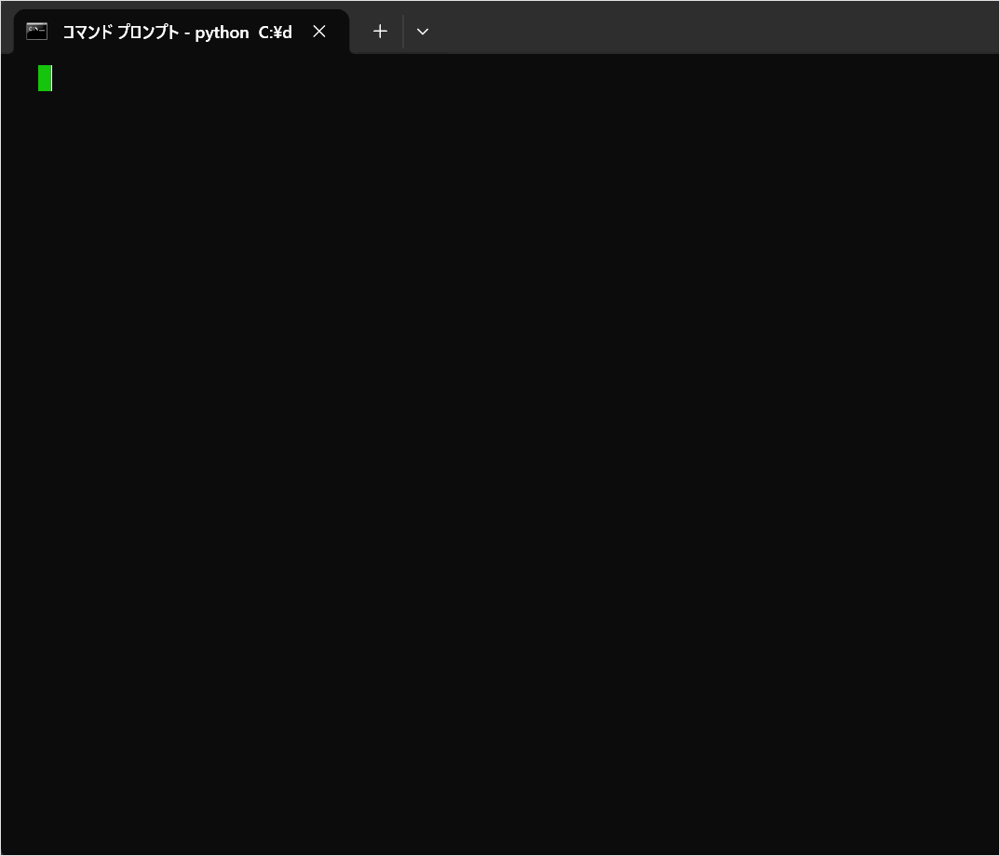

# Python Micro OS

Pythonで作った、レトロPC風のマイクロOSプロジェクトです。

黒い画面、緑色の文字、起動時のMEMORY TEST――  
昔のコンピュータの“ロマン”を、Pythonで再現してみました。

## Features

- 起動演出
- MEMORY R/W TEST
- コマンド入力
- REBOOT演出
- アセンブラ風UI
- 疑似ファイルシステム
- BASIC風コンソール

## Screenshot



## Run

```bash
python main.py
```

## Concept

これは本物のOSではなく、
「OSっぽい世界観を楽しむ」ためのPython製コンソールアプリです。

レトロPC・BIOS・アセンブラ風UIが好きな人向け。
